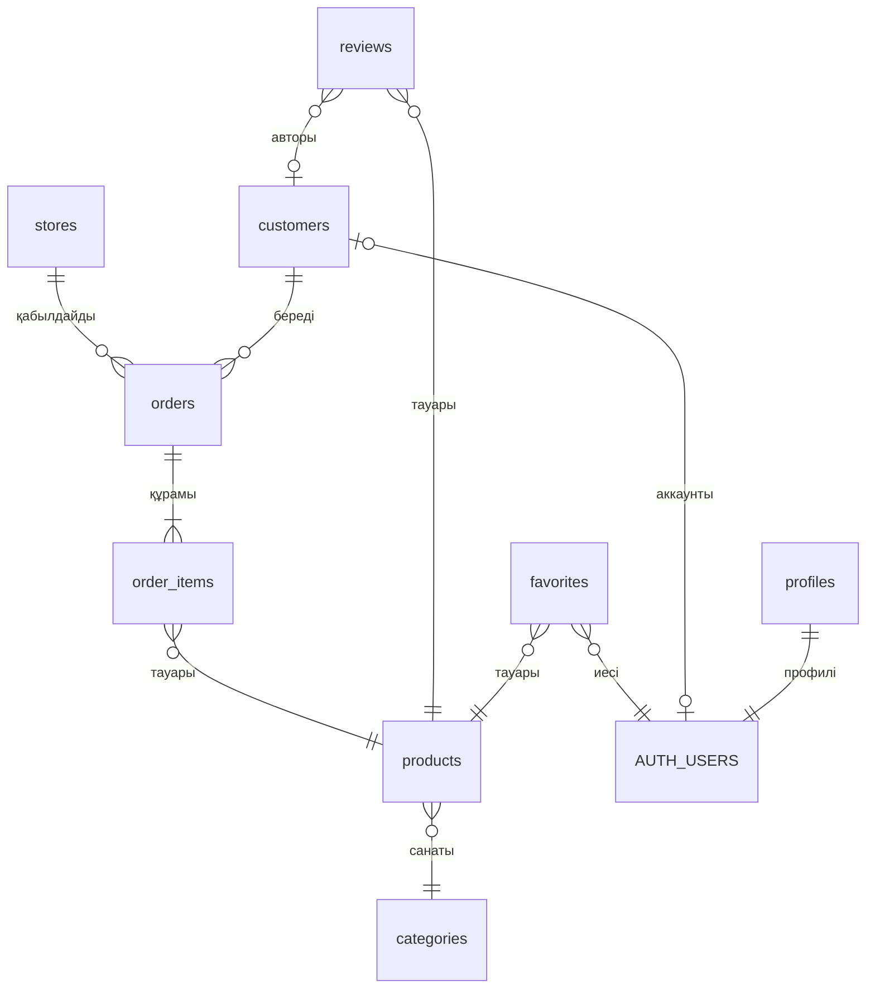

# Supabase үшін SQL · Tobylğy дүкенімен практикалық курс

Supabase — бұл Postgres дерекқоры және оның үстіндегі дайын API, Auth (тіркелу, кіру),
Storage. Кестелер, сұраулар, рұқсаттар — бәрі SQL-мен жазылады. Сондықтан Supabase-ті
үйренудің ең тура жолы — SQL-ді үйрену.

Курс 10 сабақтан тұрады. Барлық мысал бір дүкеннің деректерімен жасалған: Tobylğy
сайтындағы нақты тауарлар (Кресло Aru, Диван Tamir, Асхана жиынтығы Dala ...), олардың
түстері мен бағалары, Zetta, Zeta, Сымбат дүкендері. Әр сабақтың соңында тапсырмалар бар,
шешімдері `sheshimder.sql` файлында.

Барлық файл Supabase-тің жергілікті көшірмесінде (Postgres 17) сабақ ретімен толық
орындалып тексерілген.

## Қалай бастау керек

1. [supabase.com](https://supabase.com) сайтында тіркеліп, **New project** басыңыз.
   Оқу үшін бөлек, бос жоба ашыңыз, тегін жоспар жеткілікті.
2. Сол жақ мәзірден **SQL Editor** → **New query**.
3. Сабақ файлын ашып, ішін толық көшіріп, SQL Editor-ға қойыңыз.
4. Файлдың басындағы нұсқау бойынша орындаңыз (төмендегі кестеде де жазылған).
5. Нәтижені **Table Editor**-дан қараңыз.

## Сабақтар

| # | Файл | Не үйренесіз | Қалай орындау |
| --- | --- | --- | --- |
| 1 | [01_create_table.sql](01_create_table.sql) | Кесте құру, дерек түрлері, шектеулер, RLS | толық, бір рет |
| 2 | [02_insert_update_delete.sql](02_insert_update_delete.sql) | insert, update, delete, upsert | толық, бір рет |
| 3 | [03_select_where.sql](03_select_where.sql) | select, where, order by, limit | сұрауларды бір-бірден |
| 4 | [04_group_by.sql](04_group_by.sql) | count, sum, avg, group by, having | сұрауларды бір-бірден |
| 5 | [05_foreign_keys.sql](05_foreign_keys.sql) | Кестелер байланысы, on delete, индекстер | толық, бір рет |
| 6 | [06_join.sql](06_join.sql) | join, left join | сұрауларды бір-бірден |
| 7 | [07_subquery_cte_window.sql](07_subquery_cte_window.sql) | Ішкі сұрау, CTE, case, күндер, терезе функциялары | сұрауларды бір-бірден |
| 8 | [08_view_function_trigger.sql](08_view_function_trigger.sql) | view, function (`.rpc()`), trigger | толық, бір рет |
| 9 | [09_rls_auth.sql](09_rls_auth.sql) | Supabase Auth және RLS саясаттары | толық, бір рет |
| 10 | [10_rls_test.sql](10_rls_test.sql) | RLS-ті әртүрлі қолданушы болып тексеру | блоктарды бір-бірден |
| 11 | [11_supabase_js.md](11_supabase_js.md) | Сол сұраулар JavaScript-те (supabase-js) | оқу |
| | [sheshimder.sql](sheshimder.sql) | Барлық тапсырманың шешімі | әр шешімді жеке |
| | [99_tazalau.sql](99_tazalau.sql) | Курсты басынан бастау үшін бәрін өшіру | толық |

«Толық, бір рет» деген файлдар кесте, функция құрады не дерек енгізеді: оларды екінші рет
орындасаңыз, "already exists" қатесі шығады. Басынан бастау керек болса:
`99_tazalau.sql` → `01` → `02` → ...

## SQL Editor-мен жұмыс: 4 кеңес

- **Белгілеп орындау.** Сұрауды тышқанмен белгілеп, Run (Ctrl + Enter) бассаңыз, тек
  белгіленген бөлік орындалады.
- **Бір ғана нәтиже көрінеді.** Бірнеше сұрауды бірге орындасаңыз, Editor соңғы
  нәтижені ғана көрсетеді. Сондықтан 3, 4, 6, 7-сабақтарда сұрауларды бір-бірден орындаңыз.
- **Түсініктемені алу.** Жолдарды белгілеп, Ctrl + / (Mac-та Cmd + /) басыңыз: `--`
  белгілері алынады не қайта қойылады. Сабақтардағы әдейі қате беретін мысалдар
  түсініктеме ішінде тұр.
- **Сынақ режимі.** Деректі өзгертетін тапсырманы жаңа query бетінде
  `begin; ... rollback;` арасына жазыңыз: нәтижесін көресіз, бірақ өзгеріс сақталмайды.
  Сабақ файлының ішінде қолданбаңыз: `rollback` одан бұрынғы командаларды да жояды.

## Дерекқор схемасы

`AUTH_USERS` — Supabase Auth-тың `auth.users` кестесі. `profiles`, `favorites` және
`customers.user_id` 9-сабақта қосылады.

Сынақ деректері: 8 санат, 4 дүкен, 16 тауар (сайттағы модельдер, түстер, бағалар),
9 клиент, 12 тапсырыс, 7 пікір. Клиенттердің есімдері ойдан алынған, телефондары жалған.

## Supabase-тің 8 ережесі

Курс бойы осы ережелер сақталған. Өз жобаңызда да ұстаныңыз:

1. `public` схемасындағы әр кестеге RLS қосыңыз (1, 9-сабақ).
2. Саясатта `auth.uid()`-ді `(select auth.uid())` деп жазыңыз: жылдамырақ (9).
3. `service_role` / `secret` кілтін браузерге ешқашан қоймаңыз (9, 11).
4. view-ға `with (security_invoker = on)` жазыңыз, әйтпесе ол RLS-ті айналып өтеді (8).
5. Функцияға `set search_path = ''` жазып, кестені толық атымен атаңыз: `public.products` (8).
6. `public`-тегі функцияларды API арқылы кім шақыра алатынын `revoke execute` арқылы шектеңіз (9).
7. Сыртқы кілт бағандарына индекс қосыңыз (5).
8. id үшін `bigint generated always as identity`, уақыт үшін `timestamptz` алыңыз (1).

Supabase-тің **Advisors → Security Advisor** және **Performance Advisor** бөлімдері осы
қателерді өзі іздейді. Курстың соңында олар бірде-бір ескерту (WARN) көрсетпеуі керек.

## SQL сөздігі

| SQL | Қазақша | | SQL | Қазақша |
| --- | --- | --- | --- | --- |
| table | кесте | | query | сұрау |
| column | баған | | NULL | мәні жоқ, белгісіз |
| row | жол | | index | индекс |
| primary key | бастапқы кілт | | view | көрініс |
| foreign key | сыртқы кілт | | trigger | триггер |
| constraint | шектеу | | policy | саясат (рұқсат ережесі) |
| data type | дерек түрі | | role | рөл |
| default | әдепкі мән | | transaction | транзакция |

## Әрі қарай

- Supabase құжаттары: [Database](https://supabase.com/docs/guides/database/overview),
  [Row Level Security](https://supabase.com/docs/guides/database/postgres/row-level-security),
  [JavaScript клиенті](https://supabase.com/docs/reference/javascript/select).
- Практикалық жоба: Tobylğy бетіндегі `PRODUCTS` массивін Supabase-ке көшіріп, тауарларды
  дерекқордан жүктеу. Бастауы [11_supabase_js.md](11_supabase_js.md) файлының 3-бөлімінде.
